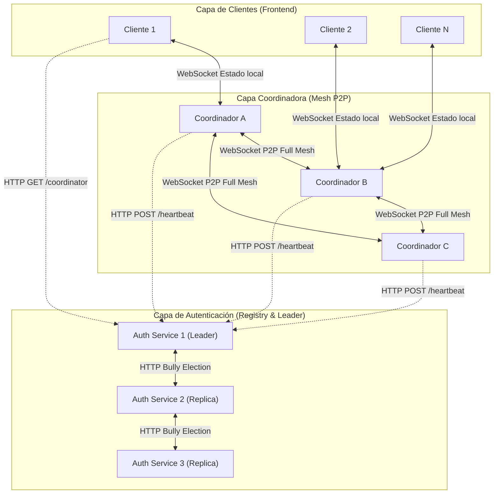

# Radar de Pilotos - UB (Among Us Distribuido P2P)

**Arquitectura de Sistemas Distribuidos - Taller 4**

Este proyecto es la implementación de un juego multijugador asíncrono (estilo Among Us) construido sobre una **Topología de Malla (Mesh P2P)** tolerante a fallos, con un servicio centralizado de descubrimiento y autenticación que maneja un **Algoritmo de Elección de Líder (Bully Algorithm)**.

El objetivo principal es demostrar conceptos de sistemas distribuidos: replicación de estado, tolerancia a fallos, balanceo de carga, algoritmos de consenso y reconexión dinámica.

---

# 🏗 Arquitectura del Sistema

El sistema se compone de 3 capas principales:



## 1. Auth Service (Directorio y Autenticación)

- Actúa como servicio de registro y balanceador de carga.
- Maneja la emisión de **JSON Web Tokens (JWT)** para la autenticación de usuarios.
- Implementa el **Algoritmo Bully** para elegir un líder entre múltiples instancias del servicio.
- El líder se encarga de administrar el estado unificado y servir el Directorio.
- Recibe **Heartbeats** periódicos (cada 3 segundos) de los coordinadores para saber cuáles están activos.
- Si un coordinador deja de enviar señales (timeout de 6 segundos), es eliminado automáticamente del registro.

---

## 2. Coordinadores (Mesh P2P)

Nodos backend que actúan como servidores de juego.

Se conectan entre sí formando una **Malla Completa (Full Mesh)**. Para evitar conexiones duplicadas, el nodo con el ID alfanumérico menor inicia la conexión hacia el nodo con ID mayor.

### Canales de comunicación

**Canal Público (`routes.js`)**
- WebSockets para los clientes locales.

**Canal P2P (`mesh.js`)**
- WebSockets entre coordinadores.
- Propagación de:
  - Jugadores
  - Intenciones de movimiento
  - Votaciones
  - Tareas
  - Estado global del juego

---

## 3. Cliente (Vanilla JS & Canvas)

Aplicación SPA (Single Page Application) renderizada mediante **Canvas API** a 60 FPS.

### Funciones principales

- Envía comandos de intención (`intent`) 20 veces por segundo.
- Realiza descubrimiento de red de forma asíncrona.
- Consulta al Auth Service.
- Obtiene la URL del coordinador con menor carga.
- Abre automáticamente un WebSocket hacia dicho coordinador.

---

# 🛠 Decisiones de Diseño

## Replicación de Estado: Event-Sourced vs Snapshotting

El juego no transmite el estado completo del mundo en cada frame.

En su lugar:

1. El cliente envía únicamente la intención de movimiento.
2. Cada coordinador calcula localmente la posición mediante interpolación determinista.
3. Periódicamente se envían snapshots para corregir desfases (rubber-banding).

---

## Failover Optimista (Desconexión Suave)

Cuando un coordinador falla:

- Los demás coordinadores marcan a sus jugadores como `disconnected`.
- No eliminan su información.
- Se conserva:
  - Rol
  - Posición
  - Tareas completadas
  - Estado general del jugador

Cuando el usuario reconecta, reclama su estado anterior.

---

## Ngrok Tunneling y Bypass de Seguridad

Ngrok introduce una advertencia de navegador en peticiones HTTP.

Para evitar bloqueos:

```javascript
{
  "ngrok-skip-browser-warning": "1"
}
```

Esta cabecera se envía tanto en:

- WebSockets
- Fetch API

---

## Caché Buster en Descubrimiento

La solicitud al endpoint `/coordinator` se realiza usando:

```javascript
fetch(url, {
  cache: "no-store"
});
```

Esto evita que el navegador reutilice una URL obsoleta durante un failover.

---

# 🚨 Modos de Falla Conocidos y Tolerancia

| Escenario de Falla | Comportamiento del Sistema |
|-------------------|----------------------------|
| Caída de un Coordinador | El cliente detecta el cierre del WebSocket, solicita un nuevo coordinador y conserva su estado. |
| Caída del Auth Service Leader | Se ejecuta el Algoritmo Bully. Las partidas continúan funcionando. |
| Pérdida temporal de Internet | El jugador queda congelado y dispone de 7 segundos para reconectarse. |
| Split Brain (aislamiento parcial) | Puede existir divergencia temporal de estado hasta restaurar la conectividad. |

---

# 🚀 Guía de Despliegue Rápido

## Requisitos Previos

- Node.js v18 o superior
- Ngrok (opcional)

---

## Paso 1: Levantar los Auth Services

Instalar dependencias:

```bash
npm install
```

Ejecutar las tres instancias:

```bash
# Terminal 1
node index.js
```

```bash
# Terminal 2
node --env-file=.env.auth2 index.js
```

```bash
# Terminal 3
node --env-file=.env.auth3 index.js
```

---

## Paso 2: Levantar Coordinadores

Instalar dependencias:

```bash
npm install
```

Ejecutar:

```bash
npm start
```

Si se ejecutan múltiples coordinadores en la misma máquina, modificar:

```env
PORT_PUBLIC=
PORT_PEER=
```

en cada archivo `.env`.

---

## Paso 3: Exponer a Internet (Opcional)

Exponer el Auth Service:

```bash
ngrok http 3000
```

Exponer un Coordinador:

```bash
ngrok http 5000
```

Actualizar:

### Cliente

```javascript
window.AUTH_SERVICES = [
  "https://tu-auth-ngrok"
];
```

### Coordinador

```env
PUBLIC_URL=https://tu-coord-ngrok
```

---

## Paso 4: Jugar

Desde la carpeta del cliente:

```bash
npx serve .
```

o utilizar **Live Server** de VS Code.

Luego:

1. Abrir la aplicación.
2. Ingresar un nombre de usuario.
3. Configurar la URL del Auth Service.
4. Conectarse a la partida.

---

# 📚 Conceptos de Sistemas Distribuidos Implementados

- Topología Mesh P2P
- Replicación de Estado
- Event Sourcing
- Snapshot Synchronization
- Heartbeats
- Failover Automático
- Reconexión Transparente
- Bully Election Algorithm
- Balanceo de Carga
- Descubrimiento de Servicios
- Autenticación JWT
- Tolerancia a Fallos
- Consistencia Eventual